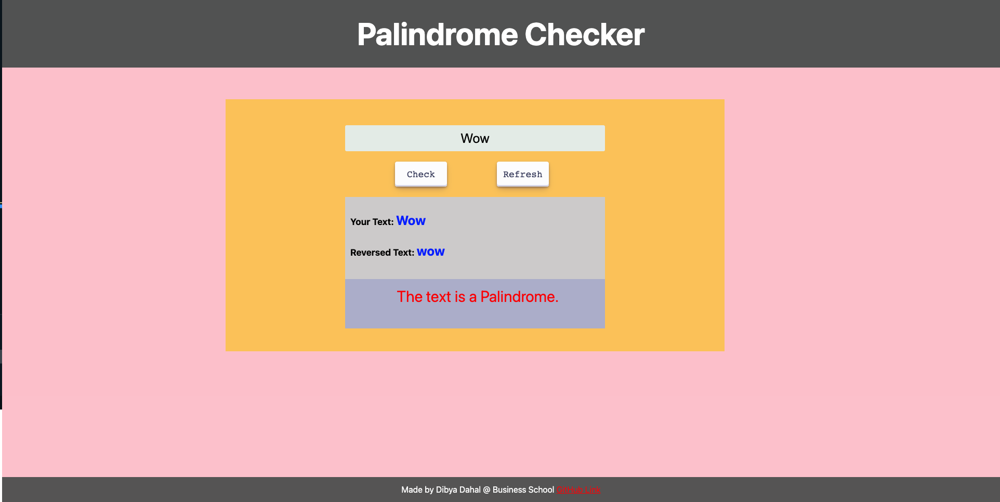

# Pallingdrome- Built on React

### The project was an assignment of Database and Data Structure Class(teacher: Santosh Kalwar).

## Build using:
* HTML
* CSS
* React JS
## Home Screen 

## Github Link
## [Press Me](https://github.com/Killerbee7/Palindrome_checker-react)

## Live Link
## [Press Me](https://unique-blancmange-d4c055.netlify.app)

